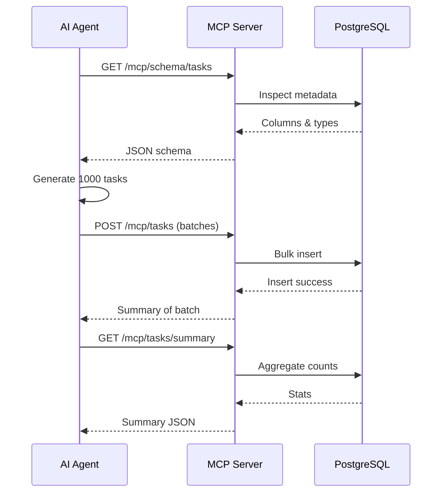

# Minimal MCP (Model Context Protocol) Server for AI‑Powered Task Data Injection

---

## 1. Plain‑Language Summary

You have (or will have) a database table that stores “tasks.”  
We want an AI assistant (e.g., Claude, GPT‑4o) to:
1. View the structure (schema) of the task table.
2. Generate many realistic sample tasks (e.g., 1,000).
3. Insert them safely (batched).
4. Retrieve a summary confirming success.

Instead of granting direct database access, we place a small Spring Boot “MCP Server” in front. The AI only calls a limited set of endpoints. This creates a controlled, auditable boundary.

---

## 2. Objective

Implement a Spring Boot server exposing these endpoints:

| Method | Endpoint              | Purpose |
|--------|-----------------------|---------|
| GET    | `/mcp/help`           | Describe available endpoints & usage |
| GET    | `/mcp/schema/tasks`   | Return a simplified JSON schema for `tasks` |
| POST   | `/mcp/tasks`          | Bulk insert an array of Task objects |
| GET    | `/mcp/tasks/summary`  | Return counts per status and total |

Success indicators:
- Server responds on all endpoints
- Schema introspection works
- 1,000 tasks inserted in valid batches
- Summary reflects inserted data
- Documentation (this file + evidence section) is updated

---

## 3. High‑Level Architecture

```
[ AI Agent ]  <--->  [ MCP Spring Boot Server ]  <--->  [ PostgreSQL Database ]
```

### 3.1 Architecture Diagram (Mermaid)

```mermaid
flowchart LR
    A[AI Agent] -->|HTTP JSON| S[MCP Server (Spring Boot)]
    S -->|JPA / JDBC| DB[(PostgreSQL)]
    subgraph Optional Existing App
      APP[Task Mgmt Backend]
    end
    APP <-->|Shared DB| DB
```

### 3.2 Data Injection Sequence



---

## 4. Technology Stack

| Layer | Choice | Rationale |
|-------|--------|-----------|
| Language | Java 17+ | Modern LTS |
| Framework | Spring Boot | Rapid REST development |
| Data Access | Spring Data JPA | Simplifies CRUD + queries |
| Database | PostgreSQL | Reliable, strongly typed |
| Build | Maven or Gradle | Standard ecosystem tools |
| Optional | OpenAPI / Swagger | Human + AI discoverability |
| Optional | Flyway | Schema versioning |
| Optional | JSON Schema library | Schema formatting |

---

## 5. Endpoints (Details)

| Method | Endpoint | Description | Typical Status |
|--------|----------|-------------|----------------|
| GET | `/mcp/help` | Lists endpoints + usage hints | 200 |
| GET | `/mcp/schema/tasks` | Simplified JSON schema | 200 |
| POST | `/mcp/tasks` | Bulk insert tasks (validate & persist) | 201 |
| GET | `/mcp/tasks/summary` | Returns totals and per-status counts | 200 |

### 5.1 Example `/mcp/schema/tasks` Response

```json
{
  "table": "tasks",
  "columns": [
    { "name": "id", "type": "UUID", "required": true, "generated": true },
    { "name": "title", "type": "VARCHAR(255)", "required": true },
    { "name": "description", "type": "TEXT", "required": false },
    { "name": "status", "type": "VARCHAR(32)", "required": true, "enum": ["NEW", "IN_PROGRESS", "DONE", "BLOCKED"] },
    { "name": "priority", "type": "INT", "required": false },
    { "name": "due_date", "type": "TIMESTAMP", "required": false },
    { "name": "created_at", "type": "TIMESTAMP", "required": true },
    { "name": "updated_at", "type": "TIMESTAMP", "required": true }
  ]
}
```

(If using camelCase JSON externally, you can clarify: DB columns snake_case; API fields camelCase.)

### 5.2 Example Insert Payload (`POST /mcp/tasks`)

```json
[
  {
    "title": "Refactor login module",
    "description": "Improve session handling and security checks",
    "status": "IN_PROGRESS",
    "priority": 2,
    "dueDate": "2025-10-15T12:00:00Z"
  },
  {
    "title": "Write onboarding guide",
    "description": "Create a newcomer-friendly FAQ and quickstart",
    "status": "NEW",
    "priority": 3,
    "dueDate": "2025-10-20T09:00:00Z"
  }
]
```

### 5.3 Example Summary Response

```json
{
  "total": 1000,
  "byStatus": {
    "NEW": 412,
    "IN_PROGRESS": 261,
    "DONE": 300,
    "BLOCKED": 27
  },
  "latestInsertedAt": "2025-09-18T09:30:11Z"
}
```

---

## 6. Data Model (JPA Entity)

```java
@Entity
@Table(name = "tasks")
public class Task {

  @Id
  @GeneratedValue
  // Consider using @org.hibernate.annotations.UuidGenerator if needed
  private UUID id;

  private String title;

  @Column(columnDefinition = "TEXT")
  private String description;

  // Constrained to NEW, IN_PROGRESS, DONE, BLOCKED
  private String status;

  private Integer priority;

  @Column(name = "due_date")
  private Instant dueDate;

  @Column(name = "created_at")
  private Instant createdAt;

  @Column(name = "updated_at")
  private Instant updatedAt;

  @PrePersist
  void onCreate() {
    Instant now = Instant.now();
    createdAt = now;
    updatedAt = now;
  }

  @PreUpdate
  void onUpdate() {
    updatedAt = Instant.now();
  }
}
```

Repository snippet:

```java
public interface TaskRepository extends JpaRepository<Task, UUID> {
  @Query("select t.status as status, count(t) as cnt from Task t group by t.status")
  List<StatusCount> groupByStatus();

  interface StatusCount {
    String getStatus();
    long getCnt();
  }
}
```

---

## 7. Implementation Steps

1. Prerequisites: Java 17+, Docker (PostgreSQL), Maven/Gradle.
2. Start PostgreSQL container.
3. Configure `application.yml`.
4. Create entity, repository, DTOs.
5. Implement controller(s).
6. Add validation (status enum, title length, batch size).
7. Test endpoints manually (`curl` or Postman).
8. Use AI prompt to insert 1,000 tasks in batches (e.g., 5 × 200).
9. Verify with `/mcp/tasks/summary`.
10. Record evidence (see Section 11).

---

## 8. Configuration (Example `application.yml`)

```yaml
spring:
  datasource:
    url: jdbc:postgresql://localhost:5432/tasks_db
    username: postgres
    password: postgres
  jpa:
    hibernate:
      ddl-auto: update
    open-in-view: false
    properties:
      hibernate.jdbc.time_zone: UTC
      hibernate.jdbc.batch_size: 100
      hibernate.order_inserts: true
      hibernate.order_updates: true
server:
  port: 8081
logging:
  level:
    root: INFO
```

---

## 9. Controller Outline (Pseudocode)

```java
@RestController
@RequestMapping("/mcp")
public class McpController {

  private final TaskRepository repo;
  private final EntityManager em;

  @GetMapping("/help")
  public Map<String,Object> help() {
    return Map.of(
      "description", "MCP Task Data Gateway",
      "endpoints", List.of(
        "/mcp/help",
        "/mcp/schema/tasks",
        "/mcp/tasks (POST)",
        "/mcp/tasks/summary"
      )
    );
  }

  @GetMapping("/schema/tasks")
  public Map<String,Object> schema() {
    // Query information_schema or JPA metamodel; return simplified structure
    // ...
  }

  @PostMapping("/tasks")
  public Map<String,Object> insert(@RequestBody List<TaskCreateRequest> requests) {
     // Validate size <= 500, status values, non-empty title
     // Map to entities and saveAll
     // Return count & maybe timing
  }

  @GetMapping("/tasks/summary")
  public Map<String,Object> summary() {
     // Query group/aggregate and return
  }
}
```

---

## 10. Validation Rules

| Field | Rule |
|-------|------|
| title | Required, non-empty, length ≤ 255 |
| status | Must be one of NEW, IN_PROGRESS, DONE, BLOCKED |
| priority | Optional; suggest range 1–5 |
| dueDate | Optional; if present must be in the future or within defined window |
| batch size | ≤ 500 per request |
| array | Not empty |

---

## 11. Evidence Template (Fill After Run)

```
Date: 2025-__-__
AI Model: (e.g., Claude 3.5 Sonnet)
Prompt Used:
" ... "

Summary Response:
{
  "total": 1000,
  "byStatus": { "NEW": ..., "IN_PROGRESS": ..., "DONE": ..., "BLOCKED": ... }
}

DB Count Check: 1000
Observations: (e.g., uniform distribution; insertion time ~2.3s)
Artifacts: See docs/summary.json and docs/summary_screenshot.png
```

---

## 12. Performance Tips

| Technique | Description |
|-----------|-------------|
| Batch inserts | `hibernate.jdbc.batch_size` set (100 typical) |
| Ordered inserts | `hibernate.order_inserts=true` |
| Pagination for reads | Add later if retrieval endpoints expand |
| Indexing | Index `status`, optionally `due_date` |
| Batching strategy | 5 × 200 better than 1 × 1000 for memory clarity |

---

## 13. Security & Safety

| Risk | Mitigation |
|------|------------|
| Arbitrary SQL | Only fixed endpoints; no dynamic query execution exposed |
| Oversized payload | Enforce max batch size |
| Invalid enum values | Whitelist status values |
| Repeated spam | Add API key or rate limiting (token bucket) |
| Sensitive PII in descriptions | Provide AI prompt guidelines to avoid personal data |
| Error leakage | Sanitize exception responses |

Simple API key filter concept (outline):
```java
// Check header X-API-Key matches configured value
```

---

## 14. Optional Enhancements

1. OpenAPI / Swagger UI (`springdoc-openapi`).
2. Audit trail table: records action type, count inserted, timestamp, agent label.
3. Retrieval endpoint: `/mcp/tasks/sample?limit=10`.
4. Filtering for summary by date range (`?from=...&to=...`).
5. Flyway for schema migrations.
6. Structured logging with correlation IDs.
7. Add test containers for integration tests (ephemeral PostgreSQL).

---

## 15. Testing Strategy

| Test Type | Coverage |
|-----------|----------|
| Unit | Validation logic, status checks |
| Integration | REST endpoints (MockMvc), schema format |
| Load | Bulk insert 1000 tasks (time, memory) |
| Negative | Invalid status, empty list, oversize batch |
| Security | Missing/invalid API key (if enabled) |

JUnit sample:

```java
@SpringBootTest
@AutoConfigureMockMvc
class McpControllerTests {

  @Autowired MockMvc mock;

  @Test
  void helpEndpointWorks() throws Exception {
    mock.perform(get("/mcp/help"))
        .andExpect(status().isOk())
        .andExpect(jsonPath("$.endpoints").isArray());
  }
}
```

---

## 16. Troubleshooting

| Symptom | Possible Cause | Resolution |
|---------|----------------|-----------|
| 500 on summary | Table empty or query issue | Verify inserts; check logs |
| Insert slow | Batch size not applied | Confirm Hibernate props applied |
| Wrong timestamps | Time zone misconfig | Ensure UTC config & DB timezone |
| Validation errors | Bad status or empty title | Adjust AI prompt / request payload |
| DB connect fail | Container not running | `docker ps`; restart |

---

## 17. Performance / Scaling Notes

- For extremely large synthetic sets (e.g., >50k tasks), consider streaming/batching at 500–1000 rows per request.
- Monitor memory during JSON parsing (Jackson). Extremely large single payloads may cause spikes.
- Consider asynchronous processing if future expansion requires background ingestion.

---

## 18. Changelog

| Date | Change | Author |
|------|--------|--------|
| 2025-09-18 | Initial comprehensive README (refined) | (Team) |

---

## 19. License / Ownership

(Define license here: MIT, Apache 2.0, or “Internal Use Only.”)

---

## 20. Quick Start (Condensed)

1. Run PostgreSQL via Docker.
2. Configure `application.yml`.
3. Run Spring Boot app.
4. Check `/mcp/help`.
5. Insert tasks in batches via `/mcp/tasks`.
6. Verify with `/mcp/tasks/summary`.
7. Record evidence.

---

## 21. Naming Consistency Note

- External JSON fields: camelCase (e.g., `dueDate`, `createdAt`, `updatedAt`).
- Database columns: snake_case (mapped with `@Column(name="...")`).
- Document this clearly for AI agents to prevent mismatched payloads.

---

End of documentation.
