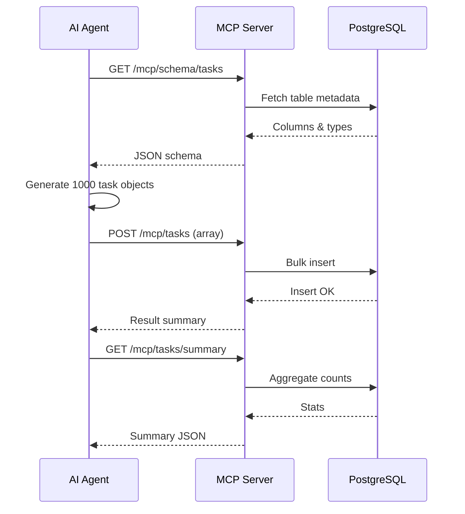

# Minimal MCP (Model Context Protocol) Server for AI‑Powered Task Data Injection


---

## 1. Plain‑Language Summary (Non‑Technical Friendly)

You have (or will have) a database table that stores “tasks” (things to do).  
We want an AI assistant (like Claude, GPT‑4o, etc.) to:
1. Look at what the task table looks like (its structure).
2. Create lots of realistic example tasks (e.g., 1,000).
3. Insert them safely into the database.
4. Show a summary so we can verify everything worked.

Instead of letting the AI touch the database directly (which can be risky), we build a **small protective web service** (the “MCP Server”).  
The AI talks ONLY to that server through a few controlled endpoints.  
Think of the MCP Server as a polite receptionist standing between the AI and your database.

---

## 2. Objective (Assignment Recap)

Build a Spring Boot service (Java 17+) that exposes these MCP endpoints:

| Method | Endpoint              | Purpose |
|--------|-----------------------|---------|
| GET    | `/mcp/help`           | Describe available endpoints (human + AI readable) |
| GET    | `/mcp/schema/tasks`   | Return a simplified JSON schema describing the `tasks` table |
| POST   | `/mcp/tasks`          | Insert an array of new Task objects |
| GET    | `/mcp/tasks/summary`  | Return summary statistics (e.g., counts per status, total) |

Success criteria:
1. MCP Server runs & responds.
2. Schema inspection works.
3. AI (or you) inserts 1,000 realistic tasks.
4. Summary reflects those inserted records.
5. Actions are documented (prompt, output, evidence).

---

## 3. High‑Level Architecture

```
[ AI Agent ]  <--->  [ MCP Spring Boot Server ]  <--->  [ PostgreSQL Database ]
```

The MCP Server is NOT the same as your primary application (if one exists). It is a **controlled access layer**.

### 3.1 Mermaid Architecture Diagram
```mermaid
flowchart LR
    A[AI Agent (Claude / GPT‑4o)] -->|HTTP JSON| S[MCP Server<br/>Spring Boot]
    S -->|JPA / JDBC| DB[(PostgreSQL)]
    subgraph Optional Existing App
      APP[Task Mgmt Backend]
    end
    APP <-->|Shared DB| DB
```

### 3.2 AI Data Injection Sequence


---

## 4. Technology Stack

| Layer | Selection | Why |
|-------|-----------|-----|
| Language | Java 17+ | Modern LTS |
| Framework | Spring Boot | Fast REST development |
| Data | Spring Data JPA | Simplifies CRUD & schema access |
| DB | PostgreSQL | Reliable relational storage |
| Build | Maven or Gradle | Standard Java build tools |
| Optional | Swagger/OpenAPI | Human-friendly docs |
| Optional | Flyway | Versioned DB migrations |
| Optional | JSON Schema generator | Cleaner schema response |

---

## 5. Endpoints (Functional Detail)

| Method | Endpoint | Description | Typical Status |
|--------|----------|-------------|----------------|
| GET | `/mcp/help` | Returns a simple object describing each endpoint & usage notes | 200 |
| GET | `/mcp/schema/tasks` | Simplified JSON schema of the `tasks` table | 200 |
| POST | `/mcp/tasks` | Bulk insert list of Task DTOs | 201 (or 200) |
| GET | `/mcp/tasks/summary` | Aggregated statistics (`total`, counts by `status`) | 200 |

### 5.1 Example `/mcp/schema/tasks` Response
```json
{
  "table": "tasks",
  "columns": [
    { "name": "id", "type": "UUID", "required": true, "generated": true },
    { "name": "title", "type": "VARCHAR(255)", "required": true },
    { "name": "description", "type": "TEXT", "required": false },
    { "name": "status", "type": "VARCHAR(32)", "required": true, "enum": ["NEW","IN_PROGRESS","DONE","BLOCKED"] },
    { "name": "priority", "type": "INT", "required": false },
    { "name": "due_date", "type": "TIMESTAMP", "required": false },
    { "name": "created_at", "type": "TIMESTAMP", "required": true },
    { "name": "updated_at", "type": "TIMESTAMP", "required": true }
  ]
}
```

### 5.2 Example Insert Payload (`POST /mcp/tasks`)
```json
[
  {
    "title": "Refactor login module",
    "description": "Improve session handling and security checks",
    "status": "IN_PROGRESS",
    "priority": 2,
    "dueDate": "2025-10-15T12:00:00Z"
  },
  {
    "title": "Write onboarding guide",
    "description": "Create a newcomer-friendly FAQ and quickstart",
    "status": "NEW",
    "priority": 3,
    "dueDate": "2025-10-20T09:00:00Z"
  }
]
```

### 5.3 Example Summary Response
```json
{
  "total": 1000,
  "byStatus": {
    "NEW": 412,
    "IN_PROGRESS": 261,
    "DONE": 300,
    "BLOCKED": 27
  },
  "latestInsertedAt": "2025-09-18T09:30:11Z"
}
```

---

## 6. Data Model (Representative JPA Entity)

```java
@Entity
@Table(name = "tasks")
public class Task {

  @Id
  @GeneratedValue
  private UUID id;

  private String title;
  @Column(columnDefinition = "TEXT")
  private String description;
  private String status;      // NEW, IN_PROGRESS, DONE, BLOCKED
  private Integer priority;
  private Instant dueDate;
  private Instant createdAt;
  private Instant updatedAt;

  @PrePersist
  void onCreate() {
    Instant now = Instant.now();
    createdAt = now;
    updatedAt = now;
  }

  @PreUpdate
  void onUpdate() {
    updatedAt = Instant.now();
  }
}
```

Simple repository:
```java
public interface TaskRepository extends JpaRepository<Task, UUID> {
  @Query("select t.status as status, count(t) as cnt from Task t group by t.status")
  List<StatusCount> groupByStatus();

  interface StatusCount {
    String getStatus();
    long getCnt();
  }
}
```

---

## 7. Step‑by‑Step Implementation Guide

### Step 1: Prerequisites
- Java 17+
- Git
- Docker (recommended for PostgreSQL)
- Maven or Gradle
- Optional: `jq` for pretty JSON

### Step 2: Initialize / Clone Repository
(Repo is currently empty; if starting fresh:)
```bash
git init
git remote add origin https://github.com/Ksawalakhe2024/Agentic_SDLC_Advance_Repo.git
```
(If already initialized:)
```bash
git clone https://github.com/Ksawalakhe2024/Agentic_SDLC_Advance_Repo.git
cd Agentic_SDLC_Advance_Repo
```

### Step 3: Start PostgreSQL (Docker)
```bash
docker run -d --name mcp-postgres \
  -e POSTGRES_PASSWORD=postgres \
  -e POSTGRES_USER=postgres \
  -e POSTGRES_DB=tasks_db \
  -p 5432:5432 postgres:15
```

### Step 4: Create `application.yml`
```yaml
spring:
  datasource:
    url: jdbc:postgresql://localhost:5432/tasks_db
    username: postgres
    password: postgres
  jpa:
    hibernate:
      ddl-auto: update
    open-in-view: false
    properties:
      hibernate.jdbc.time_zone: UTC
      hibernate.jdbc.batch_size: 100
server:
  port: 8081
logging:
  level:
    root: INFO
```

### Step 5: Define Task DTO for Inserts
```java
public record TaskCreateRequest(
  String title,
  String description,
  String status,
  Integer priority,
  Instant dueDate
) {}
```

### Step 6: Implement Controllers
Pseudocode outline:
```java
@RestController
@RequestMapping("/mcp")
public class McpController {

  private final TaskRepository repo;
  private final EntityManager em;

  @GetMapping("/help")
  public Map<String,Object> help() { ... }

  @GetMapping("/schema/tasks")
  public Map<String,Object> schema() { ... } // Inspect metadata via information_schema or JPA

  @PostMapping("/tasks")
  public Map<String,Object> insert(@RequestBody List<TaskCreateRequest> requests) {
     // Validate size <= 500
     // Map to Task entities
     // repo.saveAll(...)
     // return inserted count + maybe timing
  }

  @GetMapping("/tasks/summary")
  public Map<String,Object> summary() { ... }
}
```

### Step 7: Validation Rules
- `title`: non-empty, max 255
- `status`: must be one of predefined set
- Limit batch size (e.g., 500 per POST)
- Reject empty arrays

### Step 8: Run
```bash
./mvnw spring-boot:run
# or
./gradlew bootRun
```
Access: `http://localhost:8081/mcp/help`

### Step 9: Manual Tests
```bash
curl http://localhost:8081/mcp/help | jq
curl http://localhost:8081/mcp/schema/tasks | jq
curl -X POST http://localhost:8081/mcp/tasks \
  -H "Content-Type: application/json" \
  -d '[{"title":"Test A","status":"NEW"},{"title":"Test B","status":"DONE"}]'
curl http://localhost:8081/mcp/tasks/summary | jq
```

### Step 10: AI Prompt Example
> Please inspect `/mcp/schema/tasks`. Then generate and insert 1000 diverse task records (random realistic titles & descriptions, statuses NEW | IN_PROGRESS | DONE | BLOCKED, priorities 1–5, due dates within next 120 days). Insert in batches of 200 via `/mcp/tasks`. Finally call `/mcp/tasks/summary` and report totals and distribution.

### Step 11: Verifying 1000 Inserts
```bash
curl http://localhost:8081/mcp/tasks/summary | jq
docker exec -it mcp-postgres psql -U postgres -d tasks_db -c "SELECT COUNT(*) FROM tasks;"
```

### Step 12: Record Evidence
Create `docs/` folder and add:
- `summary.json`
- Screenshot of terminal or Postman response
- AI prompt text

Update section 11 below.

---

## 8. Security & Safety

| Risk | Mitigation |
|------|------------|
| Arbitrary SQL | Only expose fixed endpoints (no raw queries) |
| Oversized batches | Enforce max array length |
| Invalid statuses | Validate against enum list |
| Spam inserts | Add API key or rate limiting (e.g., Bucket4j) |
| Sensitive data leak | Prompt AI to avoid personal / confidential info |
| Injection in text fields | ORM parameter binding, not string concatenation |

Optional config for bearer token:
```java
// Simple filter checking an environment variable MCP_API_KEY
```

---

## 9. Optional Enhancements

1. OpenAPI (Swagger UI) via `springdoc-openapi-starter-webmvc-ui`.
2. Authentication + API key / token.
3. Audit table: store `timestamp`, `count_inserted`, `agent_id`.
4. Add `/mcp/tasks/sample?limit=10`.
5. Paginated `GET /mcp/tasks`.
6. Filtering in summary by date range.
7. Flyway migrations (repeatable script for enums/indexes).
8. Structured logging with correlation IDs.

---

## 10. Performance Tips

| Technique | Action |
|-----------|--------|
| Batch size | Set `hibernate.jdbc.batch_size=100` |
| Transaction | Wrap bulk insert in a single transaction where safe |
| Indexes | Index `status`, maybe `due_date` for reporting |
| Payload splitting | Insert 1000 as 5×200 to reduce memory spikes |

---

## 11. Evidence Template (Fill After Run)
```
Date: 2025-__-__
AI Model: (e.g., Claude 3.5 Sonnet)
Prompt Used:
" ... "

Summary Response:
{
  "total": 1000,
  "byStatus": { "NEW": ..., "IN_PROGRESS": ..., "DONE": ..., "BLOCKED": ... }
}

DB Count Check: 1000
Observations: (e.g., distribution balanced; insert time ~2.3s)
Screenshots: See docs/summary_screenshot.png
```

---

## 12. Troubleshooting

| Issue | Cause | Fix |
|-------|-------|-----|
| DB connection refused | Container not running | `docker ps`, restart container |
| 500 on `/mcp/schema/tasks` | Table missing | Ensure entity + DDL auto or create manually |
| Summary total = 0 | Transaction rollback | Check logs for validation errors |
| Slow inserts | No batching | Enable batch settings |
| Wrong time zone | JVM default not UTC | Add `-Duser.timezone=UTC` or config property |

---

## 13. Testing Strategy

| Test Type | What to Cover |
|-----------|---------------|
| Unit | Entity validation, status enum checks |
| Integration | Endpoints via MockMvc (schema, insert, summary) |
| Load | Insert 1000 tasks (k6/JMeter), ensure response < X s |
| Negative | Invalid status, empty title, oversize batch |
| Security (optional) | Missing/invalid API key when auth enabled |

Example JUnit snippet:
```java
@SpringBootTest
@AutoConfigureMockMvc
class McpControllerTests {
  @Autowired MockMvc mock;

  @Test
  void helpEndpointWorks() throws Exception {
    mock.perform(get("/mcp/help"))
        .andExpect(status().isOk())
        .andExpect(jsonPath("$.endpoints").exists());
  }
}
```

---

## 14. Quick Start (Condensed)

1. Run PostgreSQL container.
2. Configure `application.yml`.
3. `./mvnw spring-boot:run`
4. Call `/mcp/help`.
5. AI generates & POSTs 1000 tasks (batches).
6. Check `/mcp/tasks/summary`.
7. Save evidence & update README section 11.

---

## 15. Why This Pattern Matters

- Provides a **safe boundary** between autonomous AI and real data stores.
- Restricts actions to a **minimal, auditable set**.
- Encourages clean, parseable JSON responses the AI can reliably interpret.
- Scales: you can later add retrieval, filtering, or analytics without exposing raw SQL.

---

## 16. License / Ownership

(Define: e.g., MIT License, Apache 2.0, or Internal Use Only.)

---

## 17. Changelog (Start Here)

| Date | Change | Author |
|------|--------|--------|
| 2025-09-18 | Initial comprehensive README drafted | (AI Assistant + User) |

---

Happy Building! 🚀
